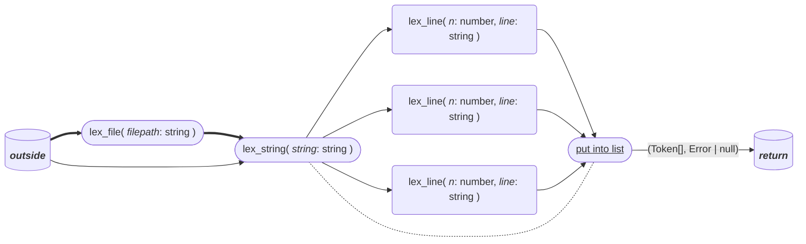

# Lexer
Implemented in [file lexer.ts](lexer.ts) 

!!!note Update this link

## Flowchart

## Specs
### Input
`string`
### Output
`tuple` of a list of all `tokens` (`Token[]`) and ev `error`
## Involved Types
### Token
In  [Tokens.ts](../tokens/tokens.ts)
Has a tokenType (enum), location and eventuall value

```ts
{
    tokenKind: TokenKind;
    location: Loc;
    value?: string;
}
```
### Tokenkind
See [Tokens.ts](../tokens/tokens.ts)
Of type `enum`
### Location (Loc)
In [Position.ts](../classes/position.ts)
```ts
{
    context: string; // Filepath or console input

    index: number; // Includes newlines (\n)
    line: number; // First row is 0
    start_colum: number; // First char is 0
    end_colum: number; // First char is 0
    // if start_col == end_col then loc is just one char
    
    //? Maybe dont use this and just check if end_line exists 
    multiline: boolean; // if multiline
    end_line?: number; // should not exists if loc is oneline
}
```
#### Error

!!!todo Add this

