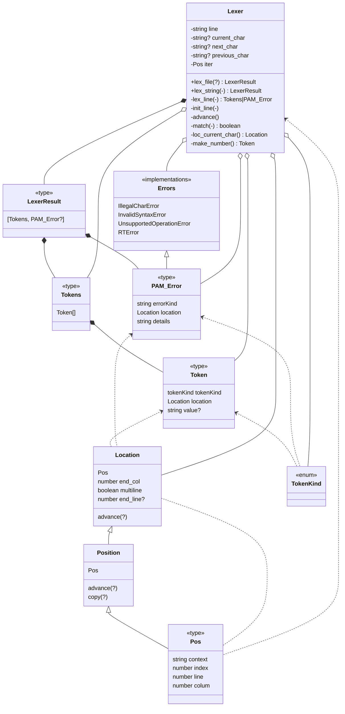

# Lexer
Implemented in [file lexer.ts](lexer.ts) 

!!!note Update this link

## Flowchart


## Class Diagram


## Specs
### Input
`string`
### Output
`tuple` of a list of all `tokens` (`Token[]`) and ev `error`
```ts
tuple[Tokens[] | null, PAM_Error | null]
```
## Involved Types
### `Token`
In  [Tokens.ts](../tokens/tokens.ts)
```ts
type Token = {
    tokenKind: TokenKind;
    location: Loc;
    value?: string;
}
```
### Tokenkind
See [Tokens.ts](../tokens/tokens.ts)
Of type `enum`
### `Location` and `Pos`
In [Position.ts](../classes/position.ts)

#### `Pos` points to a single character 
```ts
// Use the class position for use of the position.advance()
// ISSUE: #10 Class may be removed and a advance(pos: Pos): Pos may be used instead
type Pos = { 
    context: string; // Filepath or console input

    index: number; // Includes newlines (\n)
    line: number; // First row is 0
    colum: number; // First char is 0
}
```
#### `Location` refers to section of script
```ts
class Location = {
    ...Pos // extends from Pos

    end_colum: number; // First char is 0
    // if start_col == end_col then loc is just one char

    multiline: boolean; // if multiline
    end_line?: number; // should not exists if loc is oneline
}
```
### Error (`PAM_Error`)
```ts
type PAM_Error = {
    errorKind: string; // the 
    location: Location;
    details: string;
}
```
#### Types of Errors
See [Error documentation]()
  

